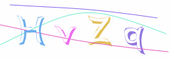

<div align=center></div>

# think-scaptcha
> 使用`PHP`生成`SVG`格式的验证码  
> 需要`PHP`大于`8.0`  
> 支持`thinkphp6`以及`thinkphp8`  
> 现已支持缓存字形，提高了在字体文件过大导致加运行过慢的问题

<p>
    <a href="https://packagist.org/packages/isszz/think-scaptcha">=8.0-8892BF.svg" alt="Minimum PHP Version"></a>
    <a href="https://packagist.org/packages/isszz/think-scaptcha">=6.x-8892BF.svg" alt="Minimum Thinkphp Version"></a>
    <a href="https://packagist.org/packages/isszz/think-scaptcha"></a>
    <a href="https://packagist.org/packages/isszz/think-scaptcha"></a>
    <a href="https://packagist.org/packages/isszz/think-scaptcha"></a>
</p>


## 避坑
- 务必开启session中间件，验证如果一直提示错误时，注意cookie的作用域，因为tp的sessionID是存储到cookie的，所以cookie作用域配置有问题也会导致无法正确验证
- 每个文字首次载入时还是需要读取字体，所以在使用英文，数字的情况缓存下来还是挺快的，因为文字种类比较少，能很快缓存下来  
- 如果自行配置`charPreset`为中文，使用中文验证码时，请务必确认所使用字体包含该汉字  
- 建议生产环境尽量使用缓存后的字形，提高生成验证码的速度

## 安装

```shell
composer require isszz/think-scaptcha
```

> 将组件内`vendor/isszz/think-scaptcha/fonts`目录下的字体放入tp根目录下config/fonts目录

## 配置

```php
<?php
// SVG 验证码配置

return [
    'type' => null, // 单独的配置项
    'cache' => true, // 是否启用字形缓存
    'width' => 150, // 宽度
    'height' => 50, // 高度
    'noise' => 5, // 干扰线条的数量
    'inverse' => false, // 反转颜色
    'color' => true, // 文字是否随机色
    'background' => '', // 验证码背景色
    'size' => 4, // 验证码字数
    'ignoreChars' => '', // 验证码字符中排除
    'fontSize' => 52, // 字体大小
    'charPreset' => 'ABCDEFGHIJKLMNOPQRSTUVWXYZabcdefghijklmnopqrstuvwxyz0123456789', // 预设随机字符
    'math' => '', // 运算模式：1=加法，2=减法，3=乘法，4=除法，或非1=4，则随机四种
    'mathMin' => 1, // 用于计算的最小值
    'mathMax' => 9, // 用于计算的最大值
    'fontName' => 'Comismsh.ttf', // 用于验证码的字体, 字体文件需要放置根目录config/fonts/目录下面

    // 单独的配置
    'admin' => [
        'color' => false,
    ],
];
```
#### 支持的url参数配置

`url`配置参数优先级最高

```shell
/scaptcha/t/单独的配置名
         /m/运算模式：1=加法，2=减法，3=乘法，4=除法，或随机四种
         /w/宽度
         /h/高度
         /s/字体大小
         /l/非运算模式时，文字数量
         /n/干扰线条数量
         /c/文字是否随机色
         /b/背景颜色
         /rt/禁用缓存字形，生产模式不建议禁用
         /reset/删除已缓存字形，不建议在生产模式一直加在url参数中，否则字形缓存无效，字体文件超过3MB会比较慢
```

## 使用方法


`composer`安装后可直接访问`/scaptcha`路径访问验证码，默认获取的是json格式:
```php
{
    'code': 0,
    'msg': 'success',
    'svg': '<svg xmlns=\"....\"></svg>',
}

```

访问`/scaptcha/svg`时获取到的是可渲染的svg：
```html
<svg xmlns="...."></svg>
```

非必要情况，可使用组件自己注册的路由地址使用


### 快捷助手函数

tp模板文件中使用

```html
<!-- 第一个参数为配置项，可参考URL参数配置，第二个参数用来设置domID -->
<div>{:scaptcha_img(['l' => 3], 'J_captcha')}</div>

```
或者

```html
<!-- 配置项参考URL参数配置 -->
<?php
    $captchaSrc = scaptcha_src([
        'l' => 5,
    ]);
?>


```

### 若需要自行在控制器输出验证码🌰

```php
class Captcha
{
    /**
     * 获取验证码, 用于api
    */
    public function index()
    {
        return json([
            'code' => 0,
            'data' => scaptcha(),
            'msg' => 'success',
        ]);
    }

    /**
     * 直接显示svg验证码
    */
    public function svg()
    {   
        $content = scaptcha();
        
        return response($content, 200, ['Content-Length' => strlen($content)])->contentType('image/svg+xml');
    }

    /**
     * 验证输入验证码是否正确|输出json
    */
    public function check($code)
    {
        $json = [
            'code' => 0,
            'msg' => 'success',
            'data' => null,
        ];

        if(!scaptcha_check($code)) {
            $json['code'] = 1;
            $json['msg'] = 'error';
        }

        return json($json);
    }
}

```

## 验证
使用组件注册的验证地址验证
```shell
/scaptcha/check/code/xxx
// 或者
/scaptcha/check?code=xxx
// 返回
{
    'code': 0, // 0=验证成；1=验证失败；2=未提交验证码；3=验证码组件报错，请issue
    'msg': 'success',
}
```

使用组件注册好的验证器规则，在控制器中验证

```php
$this->validate($data, [
    'scaptcha|验证码' => 'require|scaptcha'
]);
```
或者手动验证
```php
if(!scaptcha_check($code)) {
    // 验证失败
}
```

## 本组件基于以下开源库

- php字体库: [PhenX/php-font-lib](https://github.com/PhenX/php-font-lib)
- svg-captcha nodejs版: [lichaozhy/svg-captcha](https://github.com/lichaozhy/svg-captcha)
